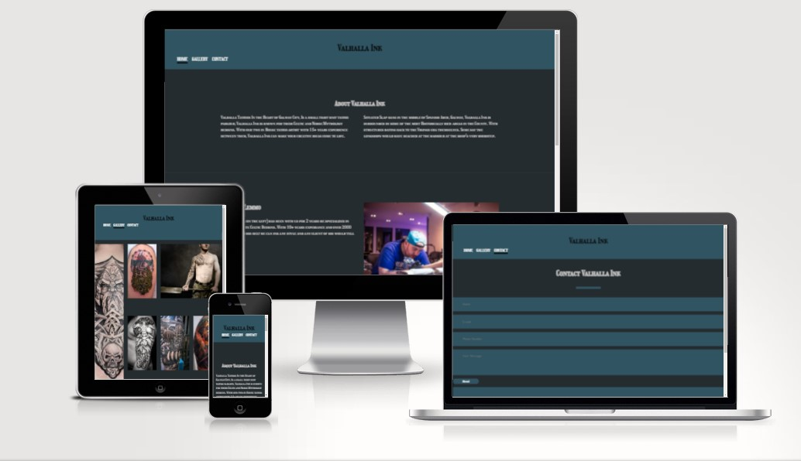

<!-- Headings -->
# Valhalla Ink 1

## [View the live site.](https://lynch4360.github.io/Valhalla-Ink-MS1/)

## [View the repository.]

### HTML/CSS Essentials - User Sentric, Static Front-End Website

## 1. Project Overview

This project creates a ficticious website for a ficticious tattoo parlour. It imagines the building to be in the heart of the coastal County of Galway. Where hundreds of years before Vikings themselves had their longboats beached. The site taps into this heritage and creates a celtic and norse based body art shop.

Valhalla Ink is a comprehensive website incorporating various technological elements to offer users a full understanding of Valhalla Ink. It is informative and showcases work done by the two in-house artists, Michael Lemmo and Sarah Crawford.

## 2. UXD - User Experience Design

The target demographic aare users aged 18-55, Really anyone who wants to get a tattoo

The main goal of the Valhalla Ink website are 

1. information  for its users. The visitors to the site will be able to see what kind of artwork is the norm for the shop. 
2. To generate traffic to the site, allow future customers to have a hub for contacting the shop

## User Stories

### A Customer will want to:

1) Learn what Valhalla Ink is.

2) Learn where the shop is.

3) Be able to contact one of the shop for design ideas.

4) See examples of tattoos already done.

### A site owner will want to:

1) Generate traffic to the shop using an online presence.

2) Drive up engagement with the public using social media.

3) Have a place to showcase the skills of their employees.

4) Have a place to find all the details about the shop.

### Future Ideas

- Implement a 
## The 5 Planes of User Experience Development.

### Scope
For this project I have decided that it is best to keep it simple. A tattoo parlour does not need a fancy website.

I feel that the website needs:

- A header that can navigate between the differant pages and would be responsive on all devices.

- A home page that talks a little bit about the Shop and gives the user some history.

- An about the authors section where future customers can build up a familiarity with the clientele.

- A footer that has Social links and any contact information.

- A Gallery page so that the user can see some of the recent work done in the shop.

- A contact page so that future customers could express their designs in an in-house format on the site rather than emailing. 

### Structure 

My wireframes can be found below. The Website is setup so that it can be viewed on as many devices as possible. This was at the forefront of my design process. 

### Wireframes
The basic structure of Valhalla Ink was sketched out on paper and from there i made a wireframe for the home page and gallery, after some design issues I then made new wireframes which then came into fruition for the live website that is linked above. Plans changed during the initial stages. I have included the old and the redesigned Wireframes Below.

##### Old Wireframes

##### Final Wireframes

### Surface
The colors blue and a blueish grey were chosen because they were very common colours back in the era of the vikings. These were very easy to make dyes for. 

### Skeleton

#### Desktop:

#### Tablet:

#### Mobile:

#### Colours

#### Typography

#### Images

All images used within this site have been provided with [pexels, paxabay] these are royalty free websites.
[https://www.pexels.com/] , [https://pixabay.com/]

All images included in the site underwent resizing using tinypng.
[https://tinypng.com/]

The favicon used for the site was taken from favicon.io
[https://favicon.io/]

#### Content

- Page content is static and won't change, when designing the layout of pages this was taken into consideration.

- As I have stated above all the images were taken from pexels and paxabay. These images are royalty feee and do not incur any copyright issues.

