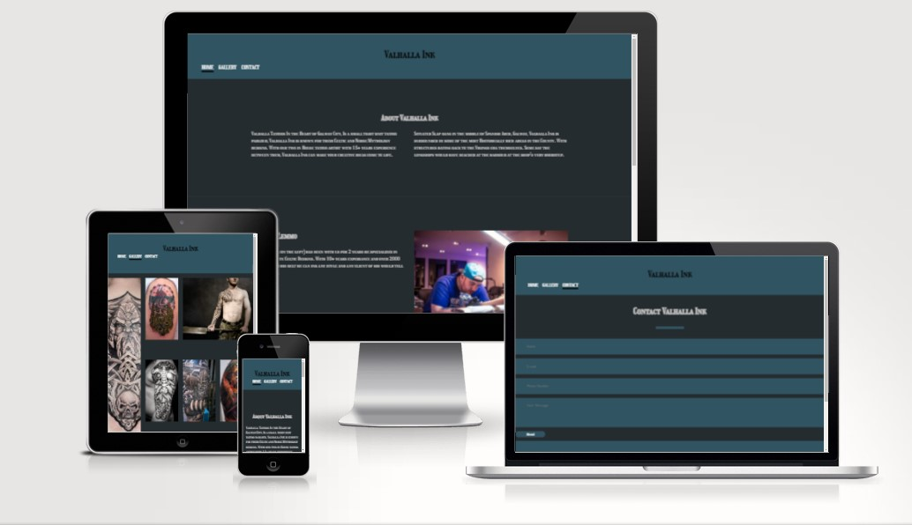

<!-- Headings -->
# Valhalla Ink

## [View the live site.](https://lynch4360.github.io/Valhalla-Ink-MS1/)

## [View the repository.](https://github.com/Lynch4360/Valhalla-Ink-MS1)

### HTML/CSS Essentials - User Sentric, Static Front-End Website

## 1. Project Overview

This project creates a ficticious website for a ficticious tattoo parlour. It imagines the building to be in the heart of the coastal County of Galway. Where hundreds of years before Vikings themselves had their longboats beached. The site taps into this heritage and creates a celtic and norse based body art shop.

Valhalla Ink is a comprehensive website incorporating various technological elements to offer users a full understanding of Valhalla Ink. It is informative and showcases work done by the two in-house artists, Michael Lemmo and Sarah Crawford.

## 2. UXD - User Experience Design

The target demographic aare users aged 18-55, Really anyone who wants to get a tattoo

The main goal of the Valhalla Ink website are 

1. information  for its users. The visitors to the site will be able to see what kind of artwork is the norm for the shop. 

2. To generate traffic to the site, allow future customers to have a hub for contacting the shop

## User Stories

### A Customer will want to:

1) Learn what Valhalla Ink is.

2) Learn where the shop is.

3) Be able to contact one of the shop for design ideas.

4) See examples of tattoos already done.

### A site owner will want to:

1) Generate traffic to the shop using an online presence.

2) Drive up engagement with the public using social media.

3) Have a place to showcase the skills of their employees.

4) Have a place to find all the details about the shop.

### Future Ideas

- Implement a FAQ, allowing the user to get more information from the site.
- Implement a map showing where exactly the shop is.
- Add a changing gallery where photos will cycle through.

## The 5 Planes of User Experience Development.

### Scope
For this project I have decided that it is best to keep it simple. A tattoo parlour does not need a fancy website.

I feel that the website needs:

- A header that can navigate between the differant pages and would be responsive on all devices.

- A home page that talks a little bit about the Shop and gives the user some history.

- An about the authors section where future customers can build up a familiarity with the clientele.

- A footer that has Social links and any contact information.

- A Gallery page so that the user can see some of the recent work done in the shop.

- A contact page so that future customers could express their designs in an in-house format on the site rather than emailing. 

### Structure 

My wireframes can be found below. The Website is setup so that it can be viewed on as many devices as possible. This was at the forefront of my design process. 

### Wireframes
The basic structure of Valhalla Ink was sketched out on paper and from there i made a wireframe for the home page and gallery, after some design issues I then made new wireframes which then came into fruition for the live website that is linked above. Plans changed during the initial stages. I have included the old and the redesigned Wireframes Below.

##### Old Wireframes

##### Final Wireframes

### Surface
The colors blue and a blueish grey were chosen because they were very common colours back in the era of the vikings. These were very easy to make dyes for. 

### Skeleton
Navigation is performed via the header, with page title links kept clear and concise. On smaller screens sizes, the content sections in the home page will stack on top of each other. In the gallery the grid will scale down width wise to fit the screen (On mobile it will only show 1 image at a time). The footer columns stack aswell when confined to a smaller screen. On larger screen sizes this is different, because both images and the information on the home screen can be seen at once. Along with the gallery where the images can be fully sized on the desktop also.

#### Desktop:

#### Tablet:

#### Mobile:

#### Colours:
Trying to keep the entire website in a uniform design, I wanted it to be a supporting colour of the theme of the tattoo parlour, so i ended up using certain colours for the header, footer and main body that would have been the clothing colour back in viking eras, (the easiest dyes to make back then were blueish greys) and then i just ensure i used contrasting colour for headings and paragraphs.

- Body backgorund color: #252c30;
- Heading and footer color: #315564;
- Text color: #CACACA;
- Logo color: #fff;

#### Typography

I decided to go with Girassal font and a cursive as a fallback font.
I felt like it was the most fitting font for a norse mythological and viking themed tattoo shop.

#### Text
All flavour text written in the home page and the about authors is of my own creation.

#### Images

All images used within this site have been provided with [pexels, paxabay] these are royalty free websites.
[https://www.pexels.com/] , [https://pixabay.com/]

All images included in the site underwent resizing using tinypng.
[https://tinypng.com/]

The favicon used for the site was taken from favicon.io
[https://favicon.io/]

#### Content

- Page content is static and won't change, when designing the layout of pages this was taken into consideration.

- As I have stated above all the images were taken from pexels and paxabay. These images are royalty feee and do not incur any copyright issues.

### Testing

Most testing was done through Developer tools in Google Chrome, whilst in the preview from Gitpod. This resulted in modifications to the code as it was being written.

#### Navigation Bar

- Click on the logo at the top of the header and see if it displays clearly.
- Click on one of the links to the other pages Gallery and Contact and see if they open.
- Can the Navigation bar be fully functional on all screen types.
- Does the nav bar appear the same on all pages of the site.

##### All tests were performed and no errors were found.

#### Footer

- Click on all social media links in the footer, do they open in a new tab, do they open to the correct site.
- Is the footer information fully functioning and legible on alla screen sizes.

##### All tests were performed and no errors were found.

#### Home Page

- Do the images stretch or become distorted on differant screen sizes.
- Does the text-wrap perform as expected when screen sizes change and is all of the text legible 100% of the time.
- Is the page responsive on all screen sizes

##### All tests were performed and no errors were found.

#### Gallery Page

- Do the images stretch or become distorted on differant screen sizes.
- Is the page responsive on all screen sizes.

##### All test were performed and no errors were found.

#### Contact Page

- Does the content of the email input box require an actual email address.
- Is the page responsive on all screen sizes.

##### All test were performed and no errors were found.

### I tested the website on the following browsers using a Chuwi Herobook Pro and a Custom built PC (intel i7 6700k, GTX 1070ti).

Google Chrome-Version 90.0.4430.212 (Official Build) (64-bit)

Firefox-Version 88.0 (64 bit)

The website was fully functional on all of these browsers. All navigation links worked. The screens responded to differant devices screen widths. All of the links in the footer worked.

The website was also tested on a Huawei P30 running Android 11.

### Validation

The following website was used for validation of my code.

[Validator For HTML5 and CSS3](https://validator.w3.org/).

All HTML files came backl with no issues

[HTML Validation Iamge] 

